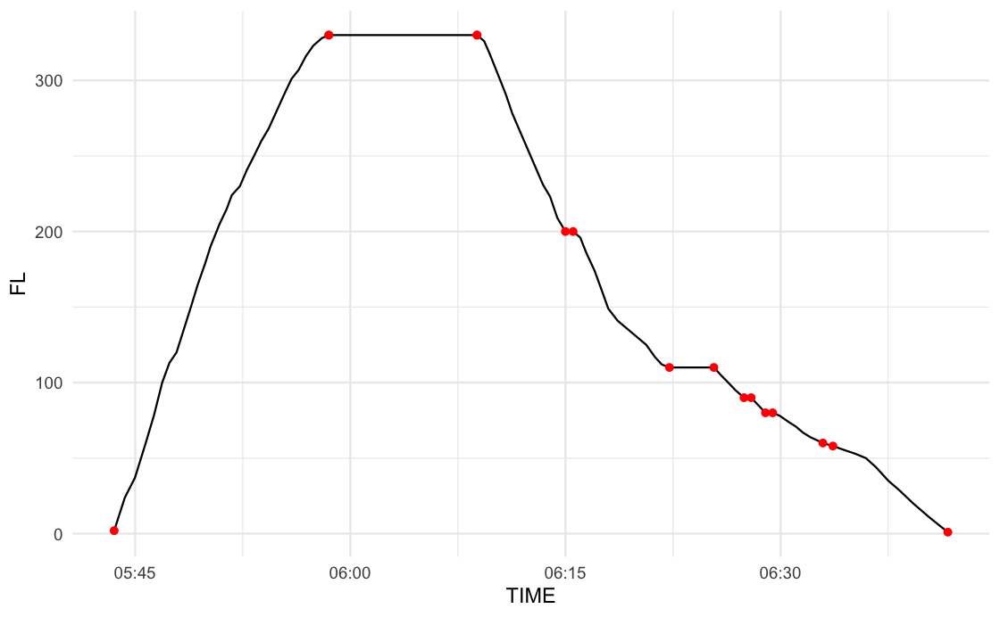

THIS VERSION IS BASED ON NM TRAJECTORIES AND SERVES TO HELP BUILDING THE 
PROCESSING PIPELINE.

```{r, message=FALSE}
library(tidyverse)
library(sf)

# set defaults
ggplot2::theme_set(ggplot2::theme_minimal())
```


# Overview

The 3Di algorithm is a composite index that combines observed horizontal and vertical (in)efficiencies as a weighted score.

The metric builds on a  surveillance trajectory for an airborne flight from which it extracts key movement events/milestones.
These milestones comprise

* START/STOP - first and last surveillance position
* LVL_START/LVL_END - for all level segments observed
* TOC/TOD - for the definition of flight phases (CLIMB, ENROUTE, DESCENT)
* additional key milestone events
  + airspace crossings - (for later aggregation on FIR / AOR basis)
  + tbd
  
```{r, out.width="60%"}

```


The algorithm entails

* horizontal component - expressed as the route extension $\tau$
* vertical component - a time- and level-weighted factor 

$$
v_{phase} =
\begin{cases}
\frac{t_i}{T} \frac{(RFL - l_i)}{RFL} = \frac{t_i}{T} * (1 - \frac{l_i}{RFL}) ,& l_i \leq RFL \\
0 ,& l_i > RFL
\end{cases}
$$

$t_i$ time at level
$l_i$ FL of i-th level segment

The vertical component requires also the RFL.
This will be extracted from the NM Flight Table (as only a max FL can be deducted from the trajectory).

The principal data processing can be summarised as follows:

```{r, out.width="60%"}

```


# Data Preparatory Step

## Trajectory Data

For this initial run, the NM trajectory for a subset of inter-Borealis flights was extracted.

```{txt}
# DO NOT RUN - FOR DOKU PURPOSES - MIGHT REQUIRE LOCAL DATA NOT IN CLOUD
# Sam prepared trajectories for the first part of 2023
# these are read in, some data cleaning and stored as analytical data 
source("./R/read_and_fix_NM_trjs.R")
source("./R/standardise_trj_NM.R")

mof    <- "042023"
rmof   <- "202304"

fn     <- paste0("./data/3Di_", mof, ".csv")
fn_out <- paste0("./data/NM-TRJ-", rmof, "-Sam1.parquet")

trjs <- read_and_fix_NM_trjs(fn) |>
  standardise_traj_from_NM()

# check cleaning success
colSums(is.na(trjs))
  
arrow::write_parquet(trjs, sink = fn_out)
```

For this study, a `trajectory` describes the airborne portion of a flight.
A trajectory is a ordered time series of 4D positions, i.e. TIME, LAT, LON, ALT.
We express ALT as general flight levels FL in decimal form, i.e. FL = ALT / 100.

A `trajectory set` comprises multiple flights (e.g. flight between an aerodrome pair, specific day).

A standardised trajectory (and associated trjectory set) follows the `tidy data` paradigm.

The standardised trajectory comprises 

* UID - a unique id for this study to identify the flight
  + TODO: NM offers to use SAM_ID; should follow the standard pattern proposed
* 4D position - TIME, LAT, LON, FL
* optional
  + SEQ_ID
  + DIST_FLOWN
  
Note: from a data standaridation perspective the SEQ_ID and DIST_FLOWN can be 
calculated from the series of 4D positions.

Note2: for this iteration, the airspace crossing algorithm builds on the existence of a sequence numbering to allocate the crossing point as an additional trajectory point (with interpolated TIME and FL).    
TODO - to harden the code, replacing the SEQ_ID with TIME might be beneficial.

Note3: The NM trajectory source data has confused columns, i.e. decimal numbers with comma.
The cleaning "overlooks" - currently - positions that sit on on integer LON. 
On average we have 1-3 missing LONs per month. 
TIMEs for midnight appear non-standard and result in NA (about 1-2 in some files).
TODO - improve cleaning script.

Show the uploaded analytic dataset of NM trajectories

```{r}
fns <- list.files(path = "./data", pattern = "^NM-TRJ")
fns
```

## Flight Table Information

A subset of the NM flight table was extracted to provide basis flight information.
The wider DAI subset was chosen with a view to add on requirements by Borealis.

Names have been adapted to reflect standard aviation terms.    
Note: EET should be AET actual elapsed time.

For the Borealis Use Case we require 

* RFL - requested flight level; input to vertical factor calculation
* NM trajectory
  + SAM_ID allows to map trajectory data with flight data
* OSN trajectory - potential mapping keys
  + ICAO24 - modeS address of airframe
  + FLTID  - flight identification ~ callsign
  + further keys
    + estimated movement times - could allow to check for "time within"
* optional
  + ADEP, ADES - can serve for verification purposes, e.g. trajectory start at ADEP


```{r}
flt_bor_dai <- arrow::read_parquet("./data/DAI-borealis.parquet") |> rename(AET = EET)
glimpse(flt_bor_dai)
```


## Airspace Data

The FIR boundaries were extracted from {pruatlas} and stored as an R data object, i.e. `borealis_firs`.

```{txt}
# DO NOT RUN - FOR DOKU PURPOSES - MIGHT REQUIRE LOCAL DATA NOT IN CLOUD
# prepare - read-in and save for future use without pruatlas
source("./R/get_firs.R")
borealis_firs <- get_borealis_firs() 
save(borealis_firs, file = "./data/FIR-borealis_firs.rda")
```

Read in the FIR airpace definitions.

```{r}
# make available borealis_firs
load("./data/FIR-borealis_firs.rda")
```

Have a quick glance

```{r}
ggplot() +
  geom_sf(data = borealis_firs)
```


# Data Processing

Following the data preparatory stage, data is process to generate a milestone/flight event table.
As presented above, the 3Di metric represents a **trajectory reduction** process.
Key flight events/milestones are extracted from the trajectory.

**NOTE: WORK IN PROGRESS** The milestons table output is stabilising. 
However, it needs to be aligned with the overall milestone/flight event table structure.
The milestone table comprises stil additional processing columns (which will be killed in the final version).

In principle, the following processing steps are performed on a per trajectory basis

* read-in trajectory data (analytic data set) - the data preparatory stage has tackled most issues, clean as appropriate
* process analytic (trajectory) data - reduce and generate the required milestones
* calculate 
  + 3Di results - per use-case/Borealis requirements
  + address algorithmic issues for discussion
  
Flight trajectories are currently archived in form of a milestone/event table.

* UID - unique (study) identification of trajectory point
* TIME - respective datetime of flight event
* LAT, LON - latitude and longitude in decimal form WGS84
* FL - ALT expressed in FL (hectofeet)
* DIST_FLOWN - cumulative distance along trajectory
  + **Note** this requires some further thinking/standardisation and/or reference. At the time being a airborne trajectory is assumed to be complete, i.e. covered from START (assumed near take-off) to END event (assumed near landing). DIST_FLOWN is understood at the accumulated point-to-point distance along the trajectory from the START event
* MST - milestone - characterises the flight event. Currently implemented:
  + START/STOP - first and last surveillance position for time series
  + LVL_START/LVL_STOP - first and last position of level segment
  + airspace crossings denoted by the combination of previous FIR/next FIR
  
NOTE: GUT FEELING SUGGESTS A COMMENT COLUMN to keep log of additional information. If "coded" could be parsed and used downstream, alternatively think about additional columns.

Other milestone columns are for debugging purposes and should be ignored (i.e. not shown next).

```{r}
mst_202304 <- arrow::read_parquet("./data/MST-3Di-202304-NM.parquet")
mst_202304 |> select(UID, TIME, LAT, LON, FL, DIST_FLOWN, MST)
```

# Result Generation

The 3Di metric is a weighted composite index.

The horizontal flight efficiency is expressed as the horizontal route extension $\tau$.
$$
\tau = \frac{DIST_{FLOWN} - DIST_{GCD}}{DIST_{GCD}} 
$$

## Measure Per Flight

many lvls 
260303240
260453626 
260780464 
260866050 

```{r}
source("./R/x_helper_plot_trj.R")  # some quick plots for trajectories

```


## TBD

This section is subject to discussion with Borealis.

# Appendix / Notes

## Trajectory Cleaning / Preprocessing

* **validity verification check** at the time being it is assumed that trajectories are a valid time series, i.e. free of longer coverage outages.
For OSN trajectories the UID generation entails the notion of a LEG (no larger time step).
A validity check should ensure "continuity" of the time series of positions.
Give the nature of the input data, it is feasible that a flight spans midnight, i.e. first part on Day 1 and 2nd part on Day 2.
In case of coverage outages this temporal trigger needs to be addressed, including "glueing" respective LEGs together (including renaming UID, etc).
